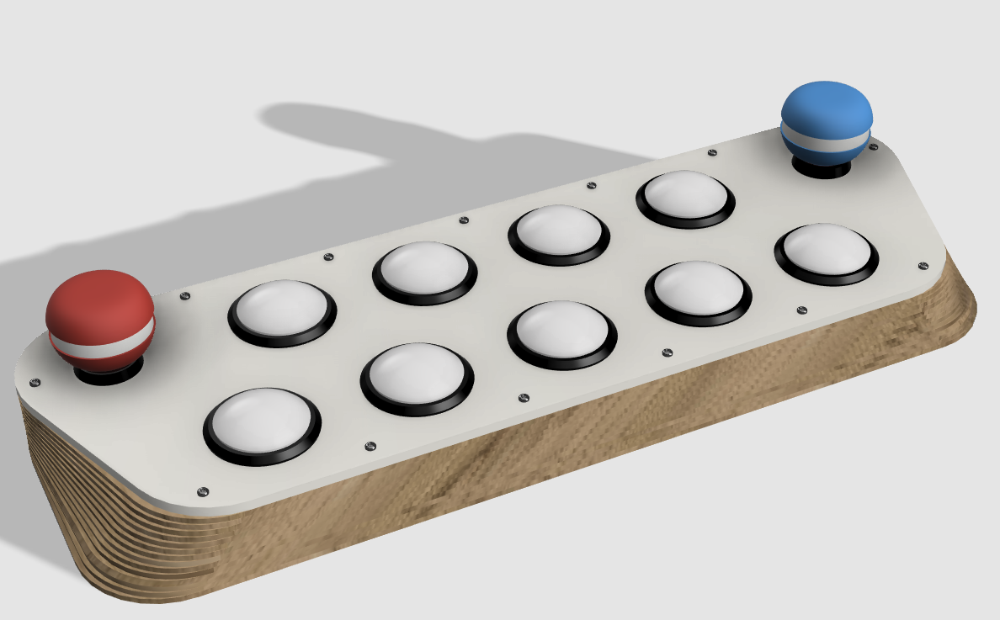
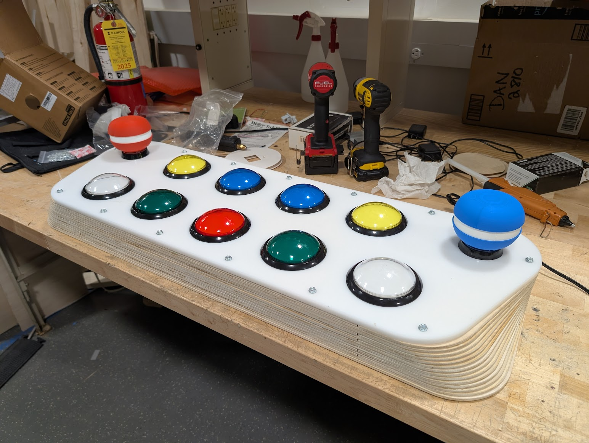
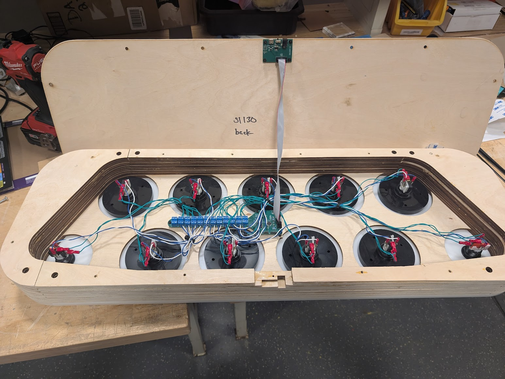

# popn2 (lutet)

version 2 of my personal pop'n music controller! we don't talk about version 1.

check out [media/44clear.mp4](media/44clear.mp4) to see me clearing my first 44 on this controller! 

## Repository Hierarchy

- **`daughterboard/`**: KiCAD PCB files for the USB and power daughterboard.
- **`firmware/`**: Source code for the mainboard's firmware.
- **`mainboard/`**: KiCAD PCB files for the STM32F072 mainboard.
- **`media/`**: Images, renders, and video showcases of the controller.
- **`production/`**: Vector files for laser-cutting the physical enclosure layers.
- **`popn2.f3z`**: Fusion 360 source file for the mechanical design.

## Mechanical Design

The physical enclosure of the controller is built using a stacked layer design. The stackup consists of:
- **13 layers of birch plywood** (Layers 1 through 13). The nominal thickness is 1/4", but the actual real-world thickness is about **5.2mm** per layer.
- **1 layer of acetal/POM** measuring **3/8" (9.5mm)** thick for the top layer.

### Buttons & Hardware
- **Gameplay Buttons:** We use 100mm Samducksa buttons from ISTMALL for the 9 main gameplay buttons. We highly recommend getting the aftermarket 100g Samducksa springs from ISTMALL rather than using the stock springs.
- **Side Buttons (Pop-kuns):** The side buttons are these 60mm OEM round buttons: [Amazon Link](https://www.amazon.com/dp/B09CYMDZCR)

## Mainboard

The mainboard is powered by an **STM32F072** microcontroller, and also functions as a generic 12-input 12-output arcade game controller. It uses individual pins for each button and darlington arrays to drive 12V LEDs.

## Daughterboard

The daughterboard handles the external inputs for the controller. The KiCAD PCB files define a board that takes **12V and USB in** and passes them along to the mainboard via a **10-pin (2x5) ribbon cable**.

## Firmware

The firmware for the STM32F072 on the mainboard is included in this repository.
For more details, please see the [firmware README](firmware/README.md).

## Production

The `production/` folder contains the production files for laser cutting each individual layer. 
The naming convention for these files is `sl[layer][part]`, where `[part]` is at most one digit.
There are also combined production files in `production/combined/` - beware that one of the pieces is missing and I don't remember which one. 

## Special Thanks

- **Illini Rhythm Syndicate** ([link](https://uiucirs.com))
- **ECE OpenLab at UIUC** ([link](https://openlab.ece.illinois.edu/))